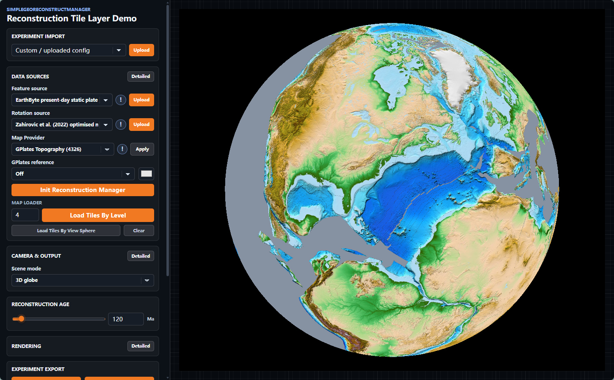

# Reconstructable Tile Layer (RTL)

English | [简体中文](README.zh-CN.md)

[](package.json)
[](package.json)
[](LICENSE)

Browser-side paleogeographic reconstruction of published Web tile services in
Cesium.

This repository contains the TypeScript reference implementation accompanying
the manuscript _Reconstructable Tile Layers for Geological-Time-Driven Digital
Earth: Browser-side Paleogeographic Reconstruction of Published Web Tile
Services without Republication_.

RTL treats geological age and the selected rigid plate model as executable
layer state. It keeps a compatible published Web tile service as the imagery
source, assigns its tile content to polygonal plate domains, applies
ROT-derived finite rotations, masks boundary tiles in WebGL, and renders the
processed fragments in Cesium. The implementation reconstructs the published
visual layer; it does not recover source attributes, topology, feature
identities, or numerical raster values.

## Demo

**Online demo:** [Launch the Reconstructable Tile Layer demo](https://computational-earth.github.io/reconstructable-tile-layer/).

The application in [`apps/reconstructable-tile-layer-demo`](apps/reconstructable-tile-layer-demo)
is the project demo started by `pnpm dev`. It:

- is powered by React, Vite, Cesium, and the four RTL workspace libraries;
- starts all library Rollup watch builds through Turbo;
- supports interchangeable imagery services, plate-domain data, and ROT models;
- reproduces the paper workflow for age changes, source-level loading,
  view-aware refinement, reference overlays, and result export.

With workspace dependencies already installed, launch the demo from the
repository root:

```sh
pnpm dev
```

After a fresh clone, or whenever `package.json` or `pnpm-lock.yaml` changes,
install the locked dependencies once before launching:

```sh
pnpm install --frozen-lockfile
pnpm dev
```

Vite prints the local URL in the terminal. While the command remains running,
changes to any library are rebuilt automatically and made available to the demo.



See the demo [English README](apps/reconstructable-tile-layer-demo/README.md) or
[Chinese README](apps/reconstructable-tile-layer-demo/README.zh-CN.md) for its
workflow, export behavior, and benchmark controller.

Ready-to-use case configurations: [English](case_configs/README.md) ·
[简体中文](case_configs/README.zh-CN.md).

Requirements: Node.js 18 or newer, pnpm 9.0.5, and a browser with WebGL support.

## Features

- Reconstructs compatible published WMS, WMTS, XYZ, and URL-template imagery
  without republishing the source service.
- Imports GPML, GPMLZ, XML, legacy JSON plate domains, and GPlates ROT models.
- Interpolates finite rotations and composes reference-plate chains.
- Indexes plate-domain coverage with lazy tile--plate quadtrees.
- Masks boundary tiles in WebGL while retaining MultiPolygon parts and holes.
- Reuses processed imagery across age changes and refines source tiles for the
  current Cesium view.
- Preserves historical APIs while exposing paper-aligned names.

## Workspaces

| Workspace                         | Source                                            | README                                                                                                                       | Role in RTL                                                                                       |
| --------------------------------- | ------------------------------------------------- | ---------------------------------------------------------------------------------------------------------------------------- | ------------------------------------------------------------------------------------------------- |
| `rtl-finite-rotation`             | [Directory](packages/rtl-finite-rotation)         | [English](packages/rtl-finite-rotation/README.md) · [简体中文](packages/rtl-finite-rotation/README.zh-CN.md)                 | Parses ROT records, interpolates unit quaternions, and composes plate-reference chains.           |
| `rtl-tile-plate-quadtree`         | [Directory](packages/rtl-tile-plate-quadtree)     | [English](packages/rtl-tile-plate-quadtree/README.md) · [简体中文](packages/rtl-tile-plate-quadtree/README.zh-CN.md)         | Builds lazy plate-domain tile indexes and produces complete or clipped source-tile entries.       |
| `rtl-webgl-tile-processor`        | [Directory](packages/rtl-webgl-tile-processor)    | [English](packages/rtl-webgl-tile-processor/README.md) · [简体中文](packages/rtl-webgl-tile-processor/README.zh-CN.md)       | Requests source imagery, remaps WebMercator textures, and produces GPU-masked images.             |
| `reconstructable-tile-layer`      | [Directory](packages/reconstructable-tile-layer)  | [English](packages/reconstructable-tile-layer/README.md) · [简体中文](packages/reconstructable-tile-layer/README.zh-CN.md)   | Implements the RTL object, task scheduling, retained records, age updates, and Cesium primitives. |
| `reconstructable-tile-layer-demo` | [Directory](apps/reconstructable-tile-layer-demo) | [English](apps/reconstructable-tile-layer-demo/README.md) · [简体中文](apps/reconstructable-tile-layer-demo/README.zh-CN.md) | Demonstrates the paper workflow with interchangeable services, models, ages, and views.           |

Each workspace README describes its method role, input contract, usage, and
retained-resource lifecycle.

## Method-to-code map

| Paper term or stage          | Recommended code API                            | Package                                               |
| ---------------------------- | ----------------------------------------------- | ----------------------------------------------------- |
| Reconstructable Tile Layer   | `ReconstructableTileLayer`                      | `reconstructable-tile-layer`                          |
| Service registration         | `provider`, `setImageryProvider`                | `reconstructable-tile-layer`                          |
| Plate-domain feature         | `PlateDomainFeature`, `PlateDomainSourceConfig` | `reconstructable-tile-layer`                          |
| `TileClipArea`               | Geographic and tile-local polygon masks         | `rtl-tile-plate-quadtree`, `rtl-webgl-tile-processor` |
| Finite-rotation interpolator | `FiniteRotationInterpolator`                    | `rtl-finite-rotation`                                 |
| Tile--plate quadtree         | `PlateDomainTileQuadtree`                       | `rtl-tile-plate-quadtree`                             |
| Composite tile task          | `CompositeTileTask`                             | `reconstructable-tile-layer`                          |
| Processed tile record        | `ProcessedTileRecord`                           | `reconstructable-tile-layer`                          |
| WebGL processor              | `WebGLTileProcessor`                            | `rtl-webgl-tile-processor`                            |
| Age-aware update             | `setReconstructionAge`                          | `reconstructable-tile-layer`                          |
| View-aware refinement        | `refineTilesForView`                            | `reconstructable-tile-layer`                          |

These names follow the Methodology section of the manuscript: service
registration; plate-domain and rotation preparation; tile--plate indexing and
task scheduling; and GPU masking and Cesium rendering.

## Minimal RTL workflow

```ts
import { ReconstructableTileLayer } from "reconstructable-tile-layer";
import { WebGLTileProcessor } from "rtl-webgl-tile-processor";

const webglProcessor = new WebGLTileProcessor({
  outputType: "canvas",
  slotCount: 4,
});

const rtl = await ReconstructableTileLayer.create({
  provider: imageryProvider,
  processor: webglProcessor,
  featureSource: {
    url: "/models/static-polygons.gpmlz",
    polygonRenderIntent: "all-polygons-area",
  },
  rotationSources: ["/models/rotations.rot"],
  initialAge: 0,
  anchorPlateId: "0",
});

rtl.bindSceneModeSync(viewer);
await rtl.loadSourceTilesAtLevel(viewer, 4);
await rtl.setReconstructionAge(120);
await rtl.refineTilesForView(viewer);

rtl.destroy(viewer);
webglProcessor.destroy();
```

The imagery provider, WebGL processor, and Cesium viewer are caller-owned.
Destroy the RTL before destroying those dependencies.

## Inputs and method scope

RTL accepts Cesium imagery providers using geographic EPSG:4326 or WebMercator
tiling schemes. Plate-domain sources may be GPML, GPMLZ, XML, the repository's
legacy JSON shape, or uploaded browser URLs. Finite rotations are read from
GPlates ROT text.

The implementation preserves MultiPolygon parts and interior rings in
`TileClipArea`. General antimeridian-crossing rings must already be encoded as
dateline-separated polygon components, matching the current method limitation
described in the manuscript.

## Development

| Command               | Purpose                                                      |
| --------------------- | ------------------------------------------------------------ |
| `pnpm dev`            | Start all library watch builds and the Vite demo.            |
| `pnpm build`          | Build all libraries, then create the demo production bundle. |
| `pnpm build:packages` | Build only the four publishable libraries.                   |
| `pnpm check`          | Run formatting, linting, builds, type checks, and tests.     |
| `pnpm test`           | Run the tile--plate quadtree tests.                          |
| `pnpm clean`          | Remove workspace build outputs and the Turbo cache.          |

The shared Rollup configuration emits ESM, CommonJS, and TypeScript declaration
outputs for all four libraries. Cesium remains a peer dependency and is not
bundled into the packages.

To start only the demo, first ensure the libraries have already been built,
then run:

```sh
pnpm --filter reconstructable-tile-layer-demo dev
```

## Compatibility

Paper-aligned names are the recommended API. Reinstall workspace dependencies
after pulling the package-name migration. Historical symbol exports remain
available, including `RotationOperator`, `QuadTreeTileProcesser`,
`QuadTreeTileProcessor`, `CesiumTileProcesser`, `CesiumTileProcessor`,
`SimpleGeoReconstructManager`, and their existing methods and option names.
No reconstruction algorithm or runtime result is changed by the aliases.

## Verification

```sh
pnpm check
```

This runs formatting, linting, package and demo builds, TypeScript checks, and
the repository's original quadtree test.

## Citation

Please cite the manuscript named above when using this implementation in
research. Author, venue, DOI, and final bibliographic metadata should be taken
from the published paper once available.

## License

Source code is licensed under the ISC License. Bundled geological and imagery
resources retain the citations and terms identified by their original
providers.
