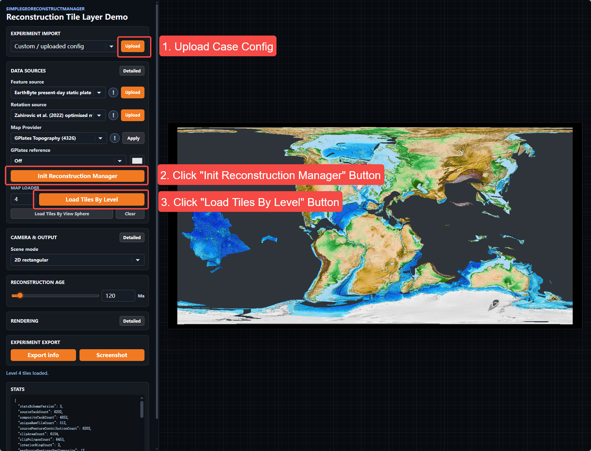

# 案例配置

[English](README.md) | 简体中文

本目录保存 Reconstructable Tile Layer demo 所使用的案例 JSON 配置。各子目录对应不同的案例。

## 使用方法

1. 在 **Experiment Import** 中选择 **Custom / uploaded config**，点击 **Upload**，并从本目录中选择一个 JSON 文件。
2. 点击 **Init Reconstruction Manager**。
3. 点击 **Load Tiles By Level**，渲染所选案例。

