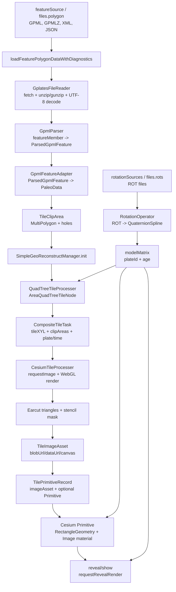

# 古地理重建代码流程说明

本文按数据流说明当前 `simple-geo-reconstruct` 包如何把板块要素文件、旋转文件和 Cesium 瓦片影像组合成可渲染的古地理重建结果。说明范围以 `packages/simple-geo-reconstruct` 的当前实现为主，并引用它依赖的 `polygon-tile-quadtree`、`tile-processer-webgl`、`plates-rotation-operator` 代码。

## 总体数据流



主流程可以理解成两条输入管线在渲染阶段汇合：

- 板块要素管线：`GPML/JSON -> ParsedGpmlFeature -> PaleoData -> TileClipArea -> QuadTree -> CompositeTileTask -> TileImageAsset -> TilePrimitiveRecord -> Cesium Primitive/reveal`。
- 旋转管线：`ROT -> RotationOperator -> plateId/age modelMatrix -> 四叉树视野过滤与 Primitive 变换`。

## 1. 入口配置与管理器状态

古地理重建的主要入口是 [`SimpleGeoReconstructManager`](../src/SimpleGeoReconstructManager.ts#L290)。构造参数包含三个关键输入：

- `provider`：Cesium `ImageryProvider`，负责提供原始瓦片影像和 tiling scheme。
- `processer`：`CesiumTileProcesser`，负责请求瓦片、重投影、裁剪并导出新瓦片图像。
- `featureSource/files.polygon` 与 `rotationSources/files.rots`：分别指向板块要素文件和 ROT 旋转文件。

文件来源由 [`resolveFeatureFiles`](../src/SimpleGeoReconstructManager.ts#L266) 统一解析。它支持新接口 `featureSource` / `rotationSources`，也兼容旧接口 `files.polygon` / `files.rots`。如果缺少要素文件或 ROT 文件，会在构造期直接抛错。

构造函数 [`constructor`](../src/SimpleGeoReconstructManager.ts#L334) 还会初始化当前年龄 `_currentAge`、Primitive 变换模式 `_transformMode`、瓦片请求并发数 `_tileRequestConcurrency` 和 Primitive 批量刷新大小 `_primitiveBatchSize`。这些状态会影响后续瓦片任务执行和渲染刷新节奏。

运行中最重要的内部数据结构是：

- `paleoData`：只保留 `renderIntent === "area"` 的面状要素，作为实际填色与裁剪来源。
- `allPaleoData`：保留所有导入要素，包括线状或未知用途要素，主要用于诊断和外部查看。
- `plates`：按 `plateId` 分组，每个板块下再按 `featureId` 保存一个 `QuadTreeTileProcesser`。
- `_compositeTileRecords`：记录已经处理过的 composite tile，包括图像资源、可选 Primitive、瓦片坐标、裁剪面、板块 ID 和有效时间；2D 预热缓存中可能存在 `primitive=null` 的记录。

## 2. 板块要素文件读取

管理器初始化时会调用 [`getPaleoDataFlatten`](../src/SimpleGeoReconstructManager.ts#L371)，内部转交给 [`loadFeaturePolygonDataWithDiagnostics`](../src/gplates/paleoDataLoader.ts#L150)。这个加载函数先根据 URL 扩展名选择读取路径：

- `.json`：走历史自定义 JSON 读取路径 [`loadCustomJsonPaleoData`](../src/gplates/paleoDataLoader.ts#L63)。
- `.gpml`、`.gpmlz`、`.xml`：走 GPML 读取路径 [`loadGpmlPaleoData`](../src/gplates/paleoDataLoader.ts#L124)。
- 其他扩展名：直接抛出不支持的文件格式错误。

GPML 路径中的文件读取由 [`readGplatesXmlFromUrl`](../src/gplates/GplatesFileReader.ts#L53) 完成。它通过 `fetch(url)` 获取 `ArrayBuffer`，再交给 [`decodeGplatesArrayBuffer`](../src/gplates/GplatesFileReader.ts#L36) 转成文本：

- 如果文件头是 gzip 魔数 `0x1f 0x8b`，使用 `fflate.gunzipSync` 解压。
- 如果文件头是 zip 魔数 `0x50 0x4b`，使用 `fflate.unzipSync` 解包，并优先选择 `.gpml` 或 `.xml` 条目。
- 如果都不是压缩格式，就直接按 UTF-8 解码。

这里的输出是完整 XML 文本，还没有变成可渲染几何。JSON 路径则直接读取数组，每个 item 取第一个 `Polygon`，转换成旧格式兼容的 `FeaturePolygonData`，并生成简单导入诊断。

## 3. GPML 解析到 PaleoData

GPML 文本先由 [`parseGpmlText`](../src/gplates/GpmlParser.ts#L414) 解析成 `ParsedGpmlFeature[]`。解析器使用浏览器 `DOMParser`，按 `featureMember` 遍历 GPML 要素。

每个 `featureMember` 由 [`parseFeatureMember`](../src/gplates/GpmlParser.ts#L358) 提取以下信息：

- `id`：优先取 `identity`，其次取 `gml:id` / `id`，最后使用 `gpml-feature-{index}`。
- `name`：取 GPML `name` 或 shapefile attribute 的 `NAME`。
- `reconstructionPlateId`：优先取 `reconstructionPlateId`，也支持从属性 `PLATEID`、`PLATEID1`、`RECON_PLATE_ID` 推断。
- `validTime`：由 [`parseValidTime`](../src/gplates/GpmlParser.ts#L125) 解析 `begin` / `end`，并处理 `distantFuture`、`distantPast`。
- `geometries`：由 [`parseGeometries`](../src/gplates/GpmlParser.ts#L276) 收集所有 `Polygon`。
- `renderIntent`：由 [`classifyRenderIntent`](../src/gplates/GpmlParser.ts#L316) 判断是 `area`、`line-like` 还是 `unknown`。

多边形几何由 [`parsePolygonGeometry`](../src/gplates/GpmlParser.ts#L242) 解析。它会读取：

- `exterior` 下的第一个 `posList` 作为外环。
- 所有 `interior` 下的 `posList` 作为洞。
- `dimension` 属性决定每个点占几个数值，默认二维。
- 坐标顺序支持 `lat-lon`、`lon-lat` 和 `auto`。自动判断时会比较经纬度合法范围得分，默认倾向 GPlates 常见的纬度/经度顺序。
- 环如果首尾未闭合，会由解析器补上首点，保证后续裁剪可使用闭合 ring。

解析出的 `ParsedGpmlFeature[]` 再由 [`parsedGpmlFeaturesToPaleoData`](../src/gplates/GpmlFeatureAdapter.ts#L131) 转成 `FeaturePolygonData[]`，这个结构与 `SimpleGeoReconstructManager.PaleoData` 对齐。转换时会：

- 跳过没有 `reconstructionPlateId` 或没有几何的 feature。
- 将每个 GPML polygon 转成 `clipArea.polygons[]`，保留外环 `exterior` 和洞 `interiors`。
- 将 `reconstructionPlateId` 转成字符串 `plateId`。
- 保留 `lonlats`，但当前主流程实际用 `clipArea` 做四叉树和 GPU 裁剪。
- 对重复原始 feature ID 加上 `:member:{featureMemberIndex}`，避免 `plateId -> featureId` 映射冲突。
- 生成 `FeatureImportDiagnostics`，统计导入要素数、面状要素数、洞数量、多 polygon feature 数、被跳过的线状/未知要素等。

## 4. 初始化与四叉树构建

[`init`](../src/SimpleGeoReconstructManager.ts#L377) 是板块要素进入空间索引的地方。它的执行顺序是：

1. 清空 `plates`、瓦片列表缓存、旋转矩阵缓存、已加载瓦片记录。
2. 调用 `getPaleoDataFlatten` 读取要素文件并得到 `loadResult.items`。
3. 将全部结果写入 `allPaleoData`，再筛选 `renderIntent === "area"` 得到 `paleoData`。
4. 按 `plateId` 建立 `PlateQuadTreeGroup`。
5. 对每个面状 feature 建立一个 [`QuadTreeTileProcesser`](../../polygon-tile-quadtree/src/QuadTreeTileProcesser.ts#L47)，传入当前 provider 的 `tilingScheme` 和 `item.clipArea`。
6. 调用 [`rotationOperator.init`](../../plates-rotation-operator/src/RotationOperator.ts#L31) 读取 ROT 文件，最后将 `_ready` 置为 `true`。

当前 GPML 转换结果传入的是 `TileClipArea`，所以 `QuadTreeTileProcesser` 会在 [`init`](../../polygon-tile-quadtree/src/QuadTreeTileProcesser.ts#L54) 中识别到面域对象，并进入 [`initArea`](../../polygon-tile-quadtree/src/QuadTreeTileProcesser.ts#L413)。这条路径是当前主流程的多 polygon / 带洞裁剪路径。

`initArea` 会按 tiling scheme 的 0 级根瓦片遍历。每个根瓦片做两件事：

- 用 [`normalizeAreaToTileRectangle`](../../polygon-tile-quadtree/src/AreaQuadTreeTileNode.ts#L218) 把经纬度 ring 归一化到当前 tile 的局部 `[0, 1]` 坐标。
- 创建 [`AreaQuadTreeTileNode`](../../polygon-tile-quadtree/src/AreaQuadTreeTileNode.ts#L244)，如果该根瓦片与面域没有交集，则跳过。

`normalizeAreaToTileRectangle` 的关键点是：输入 `TileClipArea` 里的经纬度会先按当前瓦片矩形转成局部坐标，再通过 [`clipAreaToRectangle`](../../polygon-tile-quadtree/src/AreaQuadTreeTileNode.ts#L147) 与 `[0, 0, 1, 1]` 矩形求交。这里使用 `polygon-clipping.intersection`，因此能保留 MultiPolygon 和 interior ring。

`AreaQuadTreeTileNode` 构造时会判断当前 tile 的显示状态：

- `NONE_DISPLAY`：裁剪后没有 polygon，后续不再递归。
- `FULL_DISPLAY`：面域覆盖整个 tile，后续子节点可快速继承完整显示。
- `NEED_CLIP`：只覆盖部分 tile，需要保存 `_clipArea` 并在递归时继续裁剪。

子节点展开由 [`splitNodeIfNeeded`](../../polygon-tile-quadtree/src/AreaQuadTreeTileNode.ts#L298) 完成。它会用真实 `tileXYToRectangle` 计算四个子瓦片范围，尤其 WebMercator 的南北分界不能简单取纬度算术中点，所以代码通过 `splitX` / `splitY` 反算局部比例。随后分别把父节点 `TileClipArea` 裁到左下、左上、右下、右上四个子矩形，并把裁剪结果重新归一化到子节点 `[0, 1]` 坐标。

四叉树还会计算每个面域的包围盒和包围球。`QuadTreeTileProcesser` 在 [`calAreaBoundingBox`](../../polygon-tile-quadtree/src/QuadTreeTileProcesser.ts#L562) 中向下寻找更精确的根范围，再由 [`updateBoundingSpheres`](../../polygon-tile-quadtree/src/QuadTreeTileProcesser.ts#L602) 根据板块旋转矩阵更新当前包围球。这些包围球用于视野内精细加载时的快速过滤。

## 5. ROT 文件读取与板块旋转

旋转文件由 [`RotationOperator`](../../plates-rotation-operator/src/RotationOperator.ts#L25) 管理。初始化时 [`handleRot`](../../plates-rotation-operator/src/RotationOperator.ts#L35) 会并发 fetch 所有 ROT URL，把文本合并后交给 [`convertFileContentToJson`](../../plates-rotation-operator/src/handleRot.ts#L14)。

ROT 每行会被解析成：

- `plateId`
- `age`
- rotation pole：`latitude`、`longitude`、`angle`
- `relatedId`

`RotationOperator` 会把同一个 `plateId` 的旋转记录转成 `QuaternionSpline`。后续 [`getRotateMatrix`](../../plates-rotation-operator/src/RotationOperator.ts#L63) 会按 `plateId + age` 取得旋转矩阵；[`rotatePointToModern`](../../plates-rotation-operator/src/RotationOperator.ts#L71) 则用逆旋转把当前视野包围球转回现代坐标，用于四叉树查询。

在管理器中，旋转矩阵由 [`getCachedModelMatrix`](../src/SimpleGeoReconstructManager.ts#L1696) 获取并缓存，缓存键是 `${plateId}:${age}`。矩阵主要有三处用途：

- 视野精细加载前，`loadFineTilesInViewAtResolvedLevel` 会取得当前年龄的板块矩阵，并通过 [`updateQuadTreeBoundingSpheres`](../src/SimpleGeoReconstructManager.ts#L1679) 把每个 feature 的包围球更新到当前年龄位置，供视野过滤。
- 首次创建或 reveal 当前 Age 可见瓦片时，矩阵会传给 [`createTilePrimitive`](../src/SimpleGeoReconstructManager.ts#L1274) 或 [`applyDynamicVisibilityAndMatrices`](../src/SimpleGeoReconstructManager.ts#L656)，把可见瓦片放到对应古地理位置。
- 后续 [`updateAge`](../src/SimpleGeoReconstructManager.ts#L534) 只为当前 Age 可见的已加载 record 计算矩阵，不再为不可见瓦片做旋转更新。

## 6. 瓦片任务收集与合并

瓦片加载有三类入口：

- [`generateTilePrimitivesOnLevelN`](../src/SimpleGeoReconstructManager.ts#L422)：加载指定 level 的所有相关瓦片。
- [`generateTilePrimitivesAtRoot`](../src/SimpleGeoReconstructManager.ts#L523)：加载每个面域较粗根范围内的瓦片。
- [`loadFineTilesInView`](../src/SimpleGeoReconstructManager.ts#L436)：根据当前视野估算合适 level，只加载视野内瓦片。

全量 level/root 模式由 [`collectTileTasks`](../src/SimpleGeoReconstructManager.ts#L796) 收集任务。它遍历 `plates -> polygonQuadTrees`，通过 [`getTilesForPolygon`](../src/SimpleGeoReconstructManager.ts#L1193) 从对应四叉树取 `NodeInfo[]`。`NodeInfo` 包含：

- `tileXYL`：瓦片坐标 `x/y/l`。
- `clipArea`：当前瓦片局部坐标里的多 polygon 裁剪面。
- `polygon`：旧扁平 polygon 路径的兼容字段。

视野加载由 [`collectFineTileTasksInView`](../src/SimpleGeoReconstructManager.ts#L824) 完成。它先用当前年龄的板块矩阵更新四叉树包围球，然后：

1. 对每个板块要素调用 `intersectsCurrentBoundingSphere`，快速排除不在视野附近的要素。
2. 对每个板块只计算一次 `modernViewBoundingSphere`，也就是把当前视野包围球通过 [`rotateBoundingSphereToModernCoordinates`](../src/SimpleGeoReconstructManager.ts#L1662) 转回现代坐标。
3. 调用 [`findTilesByLevelInBoundingSphere`](../../polygon-tile-quadtree/src/QuadTreeTileProcesser.ts#L473)，只在现代坐标里查询与视野相交的 tile。

多个 feature 可能落到同一个原始瓦片、同一个板块和同一有效时间范围。管理器通过 [`appendCompositeTileTask`](../src/SimpleGeoReconstructManager.ts#L880) 合并它们，合并键由 [`getCompositeTileId`](../src/SimpleGeoReconstructManager.ts#L1219) 生成：

```text
plateId:time.begin:time.end:x/y/level
```

合并后的 `CompositeTileTask` 会累积：

- `clipAreas`：同一个 composite tile 内多个 feature 的局部裁剪面。
- `coversFullTile`：如果四叉树判断该 feature 覆盖整张瓦片，则标记为完整瓦片。
- `sourceFeatureIds`：参与该 composite tile 的 feature ID 列表。
- `plateId` 与 `time`：用于旋转和年龄显隐。

这个合并非常关键：GPU 对一个 composite tile 只请求一次原始瓦片影像，然后把所有裁剪面一起画成一个输出图像，减少重复请求和重复 Primitive。

## 7. GPU 瓦片图片处理

瓦片任务执行由 [`executeTileGeneration`](../src/SimpleGeoReconstructManager.ts#L954) 控制。它会先记录本轮 `loadAge` 和 `generationToken`，再用 [`partitionTasksByAge`](../src/SimpleGeoReconstructManager.ts#L928) 把任务分成两组：

- `currentVisibleTasks`：当前 Age 下可见的瓦片，优先处理。
- `prewarmTasks`：当前 Age 下不可见的瓦片，仍然会后台处理和缓存，用于后续 Age 切换预热。

`currentVisibleTasks` 会先通过 `runStreamingWithConcurrency` 按 `_tileRequestConcurrency` 并发处理。它们创建 Primitive 时先设为 `show=false`，等当前可见批次处理完后，再由 [`revealLoadedPrimitivesForAge`](../src/SimpleGeoReconstructManager.ts#L687) 统一 reveal。`prewarmTasks` 会在当前可见批次 reveal 后继续后台执行，不阻塞当前画面显示。

每个任务的核心仍然是 [`getReprojectedTileImageAsset`](../src/SimpleGeoReconstructManager.ts#L1172)：

- 如果 `clipAreas.length > 0` 且不是完整瓦片，调用 [`reprojectMultiClippedTileAreaImage`](../../tile-processer-webgl/src/cesiumTIleProcesser.ts#L1262)。
- 如果无需裁剪，调用 [`reprojectTileImage`](../../tile-processer-webgl/src/cesiumTIleProcesser.ts#L1216)。

`CesiumTileProcesser` 内部先用 [`getImage`](../../tile-processer-webgl/src/cesiumTIleProcesser.ts#L933) 请求原始瓦片。这里直接调用 `provider.requestImage(x, y, level)`，并用两层缓存减少重复工作：

- `_imageBuffer`：缓存原始 `ImageryTypes`。
- `_imageCachePromise`：合并并发中的相同原始瓦片请求。

如果需要裁剪，`reprojectMultiClippedTileAreaImage` 会先为 `clipAreas` 生成缓存 key，然后调用 [`createClipMaskVertices`](../../tile-processer-webgl/src/cesiumTIleProcesser.ts#L1550)。这个函数会遍历所有 `TileClipArea.polygons`，由 [`appendPolygonMaskVertices`](../../tile-processer-webgl/src/cesiumTIleProcesser.ts#L1563) 做三角化：

- 外环和洞先经 `prepareEarcutRing` 去掉重复点、去掉闭合重复尾点、过滤非法或面积过小的 ring。
- `orientEarcutRing` 调整外环和洞的方向，保证 `earcut` 输入稳定。
- `earcut(flatVertices, holeIndices, 2)` 把带洞 polygon 三角化。
- 所有三角形顶点被写入 `Float32Array`，这些顶点已经是 tile 局部 `[0, 1]` 坐标。

真正的 WebGL 绘制由 [`reprojectInternal`](../../tile-processer-webgl/src/cesiumTIleProcesser.ts#L1081) 入队，渲染 worker 默认来自单 WebGL context + 多 slot 池 [`SingleContextTileRenderer`](../../tile-processer-webgl/src/cesiumTIleProcesser.ts#L543)。单个 slot 的渲染流程在 [`renderSlot`](../../tile-processer-webgl/src/cesiumTIleProcesser.ts#L619) 中完成：

1. [`updateTextureCoordBuffer`](../../tile-processer-webgl/src/glInitFunc.ts#L104) 根据 provider、`x/y/level` 更新纹理坐标。
2. [`uploadImageToTexture`](../../tile-processer-webgl/src/glInitFunc.ts#L204) 把 `provider.requestImage` 得到的影像上传到 WebGL texture。
3. 如果存在 `clipMaskVertices`，调用 [`drawSceneMasked`](../../tile-processer-webgl/src/glInitFunc.ts#L423)。
4. 如果没有裁剪，调用 [`drawScene`](../../tile-processer-webgl/src/glInitFunc.ts#L397) 直接绘制整张瓦片。
5. 把 FBO 输出复制回默认 framebuffer，然后 `cloneCanvas` 生成稳定快照。
6. 根据 `outputType` 导出为 `blobUrl`、`dataUrl` 或 `canvas`，得到 `TileImageAsset`。

纹理坐标计算在 [`getTextureCoordData`](../../tile-processer-webgl/src/glInitFunc.ts#L138)。如果 provider 使用 `WebMercatorTilingScheme`，代码会逐行计算纬度对应的 Mercator fraction，从而把源 WebMercator 图片映射到经纬度等距的 tile 局部网格；如果是 4326，则直接使用 identity texture coordinate。

多边形裁剪的当前主路径是 stencil mask。`drawSceneMasked` 分两段绘制：

1. 先把 `earcut` 生成的三角形写入 stencil buffer，关闭颜色写入。
2. 再启用颜色写入，并设置 `stencilFunc(EQUAL, 1, 0xff)`，只在遮罩内绘制重投影后的瓦片纹理。

这意味着最终 `TileImageAsset` 是一张已经完成重投影和多 polygon 裁剪的透明 PNG/canvas。Cesium 后续只需要把它作为图片材质贴到对应地理矩形上。

## 8. Cesium Primitive 创建、预热与年龄更新

当 GPU 返回 `TileImageAsset` 后，`executeTileGeneration` 会先把它保存到 `_compositeTileRecords`。是否立即创建 Cesium Primitive 取决于当前阶段和变换模式：

- 当前 Age 可见任务会创建 Primitive，但初始 `show=false`，等待当前可见批次完成后统一显示。
- 当前 Age 不可见任务仍会保留 `imageAsset` 和 record，作为后续 Age 的预热缓存。
- 在 `dynamic3D` 模式下，不可见预热任务也可以创建 hidden Primitive，方便后续只切换矩阵和显隐。
- 在 `bakedInstance` 模式下，不可见预热任务不会创建 baked Primitive，因为 baked 几何矩阵只对特定 Age 有效；这类 record 的 `primitive` 可以暂时为 `null`。

Primitive 的几何由 [`createTilePrimitive`](../src/SimpleGeoReconstructManager.ts#L1274) 创建，类型是 `RectangleGeometry`，矩形来自：

```text
provider.tilingScheme.tileXYToRectangle(x, y, level)
```

材质由 [`createImageMaterial`](../src/SimpleGeoReconstructManager.ts#L1322) 创建，使用 Cesium `Material` 的 `Image` fabric，把 GPU 输出的 `blobUrl/dataUrl/canvas` 作为 `uniforms.image`。Primitive 使用 `EllipsoidSurfaceAppearance({ flat: true })`，并关闭 depth test，使这些瓦片以覆盖层方式贴到椭球表面。

板块旋转有两种模式：

- `dynamic3D`：矩阵放在 Primitive 的 `modelMatrix` 上，适合 3D 场景动态更新。
- `bakedInstance`：矩阵放在 `GeometryInstance.modelMatrix` 上，主要用于 Cesium 2D / Columbus View morph 期间避免非 identity Primitive matrix 引发问题。

当前可见批次 reveal 由 [`revealLoadedPrimitivesForAge`](../src/SimpleGeoReconstructManager.ts#L687) 完成。3D 模式会先为当前 Age 可见 record 取得矩阵，再调用 [`applyDynamicVisibilityAndMatrices`](../src/SimpleGeoReconstructManager.ts#L656) 更新矩阵和显隐；2D baked 模式只切换已创建 Primitive 的 `show`。最后 [`requestRevealRender`](../src/SimpleGeoReconstructManager.ts#L676) 会先请求一帧，并在 `postRender` 后再补一帧，避免 request-render 模式下 reveal 后停在白屏或旧帧。

当前年龄变化由 [`updateAge`](../src/SimpleGeoReconstructManager.ts#L534) 处理：

1. 更新 `_currentAge` 并生成 `_ageUpdateToken`，防止异步结果过期。
2. 通过 `getVisibleRecordsAtAge` 找出当前 Age 可见的已加载 record。
3. 通过 `getPlateMatrixMapForRecords` 只为这些可见 record 对应的 plate 计算矩阵。
4. 如果是 `dynamic3D`，调用 `applyDynamicVisibilityAndMatrices`：不可见 Primitive 只设为 `show=false`，可见 Primitive 才更新 `modelMatrix` 并显示。
5. 如果是 `bakedInstance`，调用 [`rebuildLoadedPrimitives`](../src/SimpleGeoReconstructManager.ts#L1763)，内部再转到 [`rebuildBakedVisiblePrimitives`](../src/SimpleGeoReconstructManager.ts#L1843)：只重建当前 Age 可见 Primitive，不可见 record 保留缓存但不重建几何。

2D baked 重建时有一个专门的渲染节奏：移除旧 Primitive、添加新 hidden Primitive、统一 `show=true` 之间不请求 Cesium 渲染，只在 reveal 后走双帧 `requestRevealRender`。这样可以避免把“旧 Primitive 已移除、新 Primitive 未显示”的中间状态画到屏幕上。

显隐由 [`isVisibleAtTime`](../src/SimpleGeoReconstructManager.ts#L1920) 控制，条件是：

```text
age <= time.begine && age >= time.end
```

因此每个瓦片只在其源 feature 的有效时间范围内显示，但不可见瓦片的图像资源仍可能被缓存，用于后续切换 Age。

## 9. Provider 更新、缓存与资源释放

当影像 provider 改变时，调用 [`updateProvider`](../src/SimpleGeoReconstructManager.ts#L730)。它会清空 WebGL 处理器缓存并停止旧任务。如果新旧 tiling scheme 类型不同，还会：

- 对每个 `QuadTreeTileProcesser` 调用 [`updateProvider`](../../polygon-tile-quadtree/src/QuadTreeTileProcesser.ts#L620)，用新 tiling scheme 重建四叉树。
- 清空 `_tileListCache`。
- 移除所有旧 Primitive 和旧 `TileImageAsset`。

如果 tiling scheme 类型相同，则不会重建四叉树，只调用 [`refreshPrimitiveMaterials`](../src/SimpleGeoReconstructManager.ts#L1114) 重新请求/处理已加载 tile 的图像，并更新 record 的 `imageAsset`。如果该 record 当前有 Primitive，就同步替换 Primitive material；如果它是 2D 预热缓存且 `primitive=null`，则只更新缓存资源，等未来变成可见时再创建 Primitive。

资源释放集中在 [`clearAllTiles`](../src/SimpleGeoReconstructManager.ts#L762)、[`destroy`](../src/SimpleGeoReconstructManager.ts#L776)、[`removeAllPrimitives`](../src/SimpleGeoReconstructManager.ts#L1928) 和 [`releaseAllTileAssets`](../src/SimpleGeoReconstructManager.ts#L1944)。这些函数会取消待处理 token、清理缓存、移除 Cesium Primitive，并调用 `TileImageAsset.release()` 回收 blob URL 或 canvas。由于 `_compositeTileRecords` 现在可能保存 `primitive=null` 的预热记录，移除 Primitive 和释放图像资源是两个独立步骤。

## 10. 当前主流程的关键结论

- GPML 中的面状 feature 会被转换为 `TileClipArea`，保留 MultiPolygon 和 interior ring；当前裁剪主路径不依赖单一 `lonlats` 外环。
- 四叉树裁剪发生在 CPU 侧，输出每个 tile 局部 `[0, 1]` 坐标中的 `clipArea`。
- GPU 侧不再逐片元运行旧的射线法主路径，而是把 `TileClipArea` 先用 `earcut` 三角化，再用 stencil mask 裁剪整张重投影瓦片。
- Cesium 侧只接收已处理好的图片资源；当前 Age 可见瓦片优先 hidden 加载并统一 reveal，不可见瓦片可以作为预热缓存保留。
- 3D Age 更新只对当前可见瓦片更新 `modelMatrix`；2D baked 模式只重建当前可见 Primitive，不可见 record 保留缓存。
- ROT 旋转既影响当前可见瓦片的渲染矩阵，也影响视野内精细加载时的四叉树包围球过滤。
